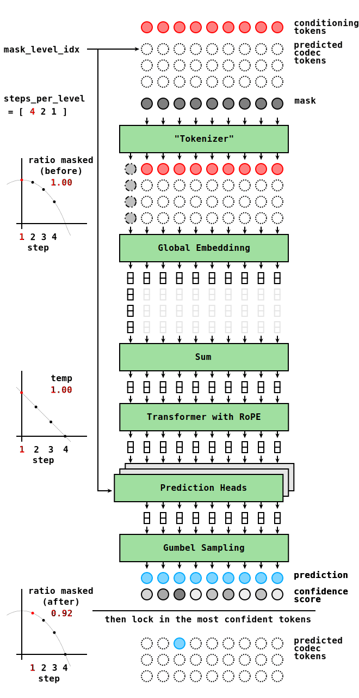

# SoundStorm Acoustic Model

An implementation of SoundStorm to convert a sequence of discrete units (conditioning tokens) into a stream of codec tokens such that they can be decoded into a waveform.

We use:
- K-means on WavLM features as input and
- SpeechTokenizer tokens as output.

We use this acoustic model in our experiments where we evaluate duration-penalized units in spoken langauge modeling.

This implementation is unprompted.
In other words, it does not use any reference tokens as a prompt to condition the model on speaker identity.
We did it this way, because we only care about reconstructing the content in the signal, not the speaker identity.
We allow the acoustic model to latch onto any learned speaker identity during generation.

This implementation can be easily adapted to other units and codecs, provided that their label rates are the same (both WavLM and SpeechTokenizer have a label rate of 50 Hz).

